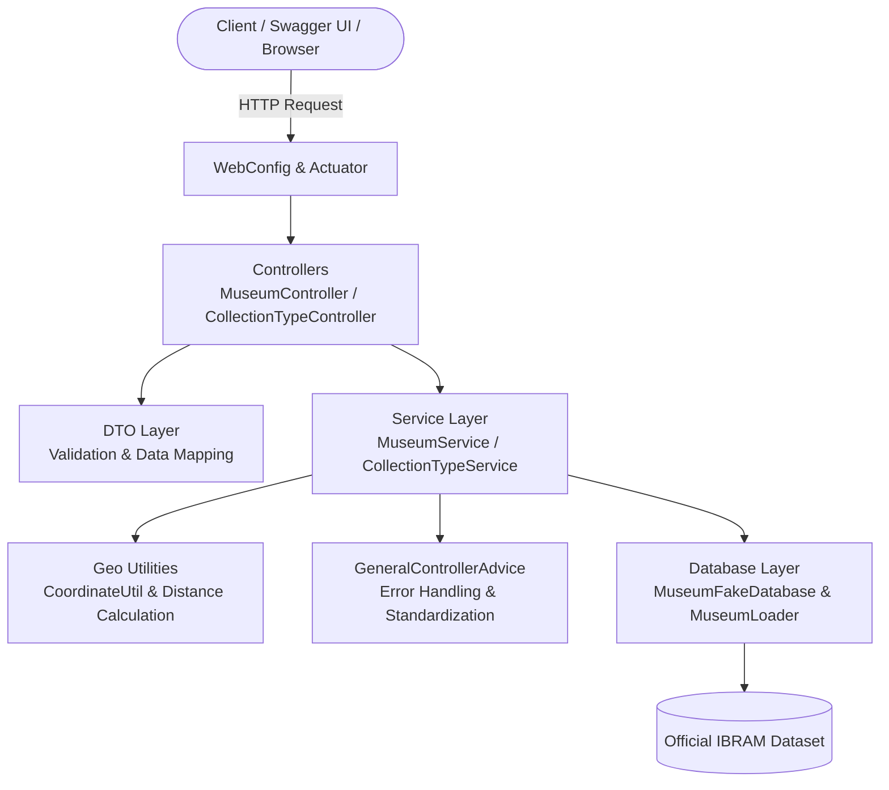

# Museum Finder API 🏛️

[](https://www.oracle.com/java/)
[](https://spring.io/projects/spring-boot)
[](https://www.docker.com/)
[](https://swagger.io/)
[](https://render.com/)
[](https://opensource.org/licenses/MIT)

> 🇧🇷 [**Versão em Português**](README.md) | 🇺🇸 **English**

A robust RESTful API built with **Java 17** and **Spring Boot 3** focused on **geospatial search for Brazilian museums** based on geographical coordinates (latitude/longitude), along with query and statistical aggregation of cultural institutions by collection types using open historical data from the **National Museum Registry (IBRAM / Brazilian Ministry of Culture)**.

---

## 📌 Quick Navigation

- [📝 About the Project](#-about-the-project)
- [🖼️ Preview](#️-preview)
- [🌐 Application Deployment / Online Swagger Demo](#-application-deployment--online-swagger-demo)
- [⚡ API Endpoints](#-api-endpoints)
- [✨ Features](#-features)
- [🛠️ Technologies and Tools](#️-technologies-and-tools)
- [🏛️ Solution Architecture](#️-solution-architecture)
- [📁 Repository Structure](#-repository-structure)
- [💡 Technical Decisions](#-technical-decisions)
- [🚀 How to Run the Project](#-how-to-run-the-project)
- [📄 License](#-license)

---

## 📝 About the Project

Brazil has an extensive and diverse cultural heritage spread across its entire territory. However, discovering cultural facilities near a user's current location is frequently challenging due to the scarcity of accessible services equipped with geospatial calculation capabilities.

**Museum Finder** addresses this issue by providing a high-performance REST API designed to:
1. **Compute real geodesic distances** between user coordinates and registered museums.
2. **Instantly identify the closest museum** within a configurable maximum distance threshold (in kilometers).
3. **Aggregate statistical insights** regarding cultural collection categories across the country (e.g., sacred art, archaeology, science, history).

The underlying dataset is loaded from open government data provided by the Brazilian Institute of Museums (IBRAM), ensuring reliable and well-structured historical records.

---

## 🖼️ Preview

<div align="center">
  
</div>

---

## 🌐 Application Deployment / Online Swagger Demo

The application is deployed on Render with built-in interactive documentation and automatic root redirect: visiting the base URL (`/`) automatically redirects to Swagger UI.

Access the live deployment:
👉 **[Museum Finder - Swagger UI](https://localizador-de-museus.onrender.com)**

> *(If running under your custom Render subdomain, update the link above accordingly)*

---

## ⚡ API Endpoints

Below are the main REST endpoints provided by the application:

| Method | Endpoint | Description |
| :--- | :--- | :--- |
| `GET` | `/` | Automatically redirects to interactive Swagger UI |
| `POST` | `/museums` | Registers a new museum |
| `GET` | `/museums/closest?lat={lat}&lng={lng}&max_dist_km={dist}` | Finds the closest museum within a maximum distance radius |
| `GET` | `/museums/{id}` | Retrieves museum details by ID |
| `GET` | `/collections/count/{typesList}` | Counts museums matching given collection types (comma-separated) |
| `GET` | `/actuator/health` | Application health check endpoint |

### Request and Response Examples

#### 1. Create Museum (`POST /museums`)
```json
// POST /museums
// Content-Type: application/json
{
  "name": "Imperial Museum",
  "description": "Former summer palace of Emperor Pedro II in Petrópolis, Brazil.",
  "address": "Rua da Imperatriz, 220 - Centro, Petrópolis - RJ",
  "collectionType": "History, Visual Arts",
  "subject": "Empire of Brazil",
  "url": "https://museuimperial.museus.gov.br",
  "coordinate": {
    "latitude": -22.5054,
    "longitude": -43.1764
  }
}
```

**Response (`201 Created`):**
```json
{
  "id": 1,
  "name": "Imperial Museum",
  "description": "Former summer palace of Emperor Pedro II in Petrópolis, Brazil.",
  "address": "Rua da Imperatriz, 220 - Centro, Petrópolis - RJ",
  "collectionType": "History, Visual Arts",
  "subject": "Empire of Brazil",
  "url": "https://museuimperial.museus.gov.br",
  "coordinate": {
    "latitude": -22.5054,
    "longitude": -43.1764
  }
}
```

#### 2. Proximity Search (`GET /museums/closest`)
```http
GET /museums/closest?lat=-22.5050&lng=-43.1760&max_dist_km=10.0
```

**Response (`200 OK`):**
```json
{
  "id": 1,
  "name": "Imperial Museum",
  "description": "Former summer palace of Emperor Pedro II in Petrópolis, Brazil.",
  "address": "Rua da Imperatriz, 220 - Centro, Petrópolis - RJ",
  "collectionType": "History, Visual Arts",
  "subject": "Empire of Brazil",
  "url": "https://museuimperial.museus.gov.br",
  "coordinate": {
    "latitude": -22.5054,
    "longitude": -43.1764
  }
}
```

#### 3. Museum Count by Collection Types (`GET /collections/count/{typesList}`)
```http
GET /collections/count/historia,artes
```

**Response (`200 OK`):**
```json
{
  "collectionTypes": [
    "historia",
    "artes"
  ],
  "count": 492
}
```

---

## ✨ Features

- 📍 **Haversine Geodesic Computation:** Validates geographical limits and calculates proximity distances in kilometers.
- 🎯 **Configurable Search Radius:** Prevents distant query results using the `max_dist_km` parameter.
- 🏛️ **Domain Integrity:** Separation between internal models and external data representations through DTOs.
- 📊 **Aggregated Statistics:** Case-insensitive counting of cultural institutions matching multiple collection tags.
- 🛡️ **Centralized Exception Handling:** Standardized HTTP responses (400 Bad Request, 404 Not Found, 500 Internal Server Error) through `@ControllerAdvice`.
- 📑 **Interactive OpenAPI 3 / Swagger:** Live UI for instant endpoint testing from any browser.
- 🔄 **Root Route Redirection:** Seamless redirect from `/` straight to `/swagger-ui.html`.

---

## 🛠️ Technologies and Tools

| Layer / Purpose | Technology | Description |
| :--- | :--- | :--- |
| **Primary Language** | **Java 17 LTS** | Records, Pattern Matching, Stream API and modern JVM enhancements |
| **Web Framework** | **Spring Boot 3.0.5** | Dependency injection, REST architecture, and simplified configuration |
| **HTTP / REST Layer** | **Spring MVC** | Declarative endpoint mapping, decoupled controllers, and DTOs |
| **Geospatial Computation** | **Haversine Geodetic Algorithm** | Spherical distance calculations and deterministic proximity sorting |
| **Observability & Metrics** | **Spring Boot Actuator** | Health check monitoring endpoints (`/health`, `/info`) |
| **Interactive Documentation** | **Swagger UI / SpringDoc OpenAPI 2.1.0** | Live OpenAPI 3 specification and integrated browser testing console |
| **Automated Testing** | **JUnit 5 & Mockito** | Unit and integration tests covering controllers and services with MockMvc |
| **Code Coverage** | **JaCoCo 0.8.10** | Automated code coverage reports and test quality metrics |
| **Containerization** | **Docker (Multi-stage Build)** | Lightweight final container image on Eclipse Temurin JRE 17 Jammy |
| **Build Management** | **Apache Maven** | Build lifecycle management, testing automation, and dependency resolution |
| **Deployment & Hosting** | **Render Cloud (PaaS)** | Continuous Docker container hosting with dynamic port resolution |

---

## 🏛️ Solution Architecture

The system follows a decoupled, layered architecture based on Separation of Concerns (SoC):



- **Controller:** REST endpoint exposure, OpenAPI operation annotations, and HTTP request dispatching.
- **Service:** Core business logic, coordinate boundary validation, and closest-entity filtering algorithms.
- **DTO:** Decouples persistent representations from public payloads transmitted over the wire.
- **Advice:** Intercepts domain and runtime exceptions across all controllers to generate consistent error schemas.

---

## 📁 Repository Structure

```text
localizador-de-museus/
├── .mvn/wrapper/                  # Maven Wrapper files
├── assets/image/                  # Documentation assets
├── images/
│   └── projeto.gif                # Animated demonstration GIF
├── src/
│   ├── main/
│   │   ├── java/com/ludson/museumfinder/
│   │   │   ├── MuseumFinderApplication.java   # Application entry point
│   │   │   ├── advice/                        # Centralized exception handlers
│   │   │   │   └── GeneralControllerAdvice.java
│   │   │   ├── config/                        # Spring configurations (OpenAPI & WebMvc)
│   │   │   │   ├── OpenApiConfig.java
│   │   │   │   └── WebConfig.java
│   │   │   ├── controller/                    # REST API Controllers
│   │   │   │   ├── CollectionTypeController.java
│   │   │   │   └── MuseumController.java
│   │   │   ├── database/                      # Data store & dataset loader
│   │   │   │   └── MuseumFakeDatabase.java
│   │   │   ├── dto/                           # Data Transfer Objects
│   │   │   │   ├── CollectionTypeCount.java
│   │   │   │   ├── MuseumCreationDto.java
│   │   │   │   └── MuseumDto.java
│   │   │   ├── exception/                     # Domain-specific exceptions
│   │   │   │   ├── InvalidCoordinateException.java
│   │   │   │   └── MuseumNotFoundException.java
│   │   │   ├── model/                         # Entities & Value Objects
│   │   │   │   ├── Coordinate.java
│   │   │   │   └── Museum.java
│   │   │   ├── service/                       # Service interfaces & business logic
│   │   │   │   ├── CollectionTypeService.java
│   │   │   │   ├── MuseumService.java
│   │   │   │   └── MuseumServiceInterface.java
│   │   │   └── util/                          # Geodesic & model conversion utilities
│   │   │       ├── CoordinateUtil.java
│   │   │       ├── ModelDtoConverter.java
│   │   │       └── MuseumLoader.java
│   │   └── resources/
│   │       ├── application.properties         # App properties and dynamic port mapping
│   │       └── data/                          # Historical open data on museums
│   └── test/                                  # Automated test suite (JUnit 5 / Mockito)
│       └── java/com/ludson/museumfinder/solution/
├── Dockerfile                     # Multi-stage production container build
├── pom.xml                        # Maven dependency management
├── README.md                      # Portuguese Documentation
└── README.en.md                   # English Documentation
```

---

## 💡 Technical Decisions

1. **Spring Boot 3 + Java 17 LTS:** Modern enterprise backend baseline utilizing JVM performance enhancements, Java records for DTOs, and Spring Framework 6 standards.
2. **Value Objects (`Coordinate`):** Encapsulating latitude and longitude into an immutable `Coordinate` object guarantees validation before geodesic distance execution.
3. **Deterministic Proximity Search (`CoordinateUtil`):** Efficient spatial iteration determining the local minimum distance while rejecting coordinates outside legal boundaries (-90° to 90° latitude, -180° to 180° longitude).
4. **SpringDoc OpenAPI 3:** Official Swagger implementation for Spring Boot 3 providing real-time synchronization between Java controllers and the OpenAPI specification.
5. **Multi-Stage Containerization:** Compiles the application in a Maven-enabled stage, producing a lightweight final artifact atop `eclipse-temurin:17-jre-jammy`, reducing image size by over 65%.
6. **Cloud-Ready Dynamic Port Binding:** Reads `${PORT:8080}` to support instant deployments on PaaS environments such as Render without requiring manual port configuration.

---

## 🚀 How to Run the Project

### Prerequisites
- [Git](https://git-scm.com/)
- [Java 17+](https://www.oracle.com/java/technologies/downloads/#java17) and [Maven](https://maven.apache.org/) **OR** [Docker](https://www.docker.com/)

### 1. Clone the Repository
```bash
git clone https://github.com/ludson96/localizador-de-museus.git
cd localizador-de-museus
```

### 2. Run with Docker (Recommended)
```bash
# Build the Docker image
docker build -t localizador-de-museus .

# Run the container on port 8080
docker run -p 8080:8080 --name localizador-app localizador-de-museus
```

Open your browser at:
👉 **[http://localhost:8080](http://localhost:8080)** (automatically redirects to Swagger UI)

---

### 3. Run Locally with Maven
```bash
# Compile and build package
mvn clean package -DskipTests

# Execute the resulting JAR
java -jar target/museum-finder-1.0-SNAPSHOT.jar
```

### 4. Run Automated Tests
```bash
mvn test
```

---

## 📄 License

This project is licensed under the [MIT](LICENSE) License. See the `LICENSE` file for details.

---

<div align="center">
  Developed by <strong>Ludson Pereira dos Santos</strong> 🚀<br />
  <a href="https://www.linkedin.com/in/ludson96/">LinkedIn</a> • <a href="https://github.com/ludson96">GitHub</a> • <a href="mailto:ludson_ps27@hotmail.com">E-mail</a>
</div>
