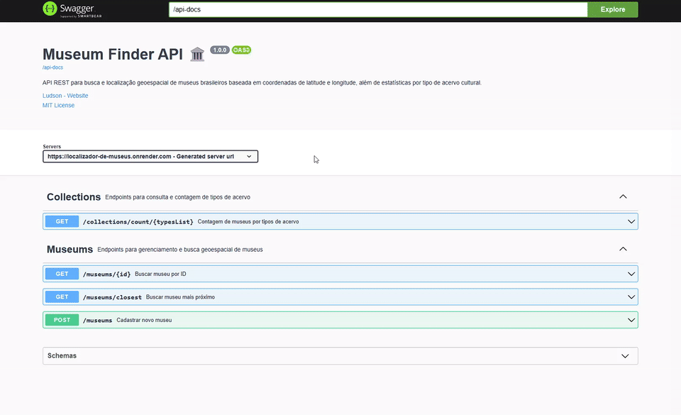
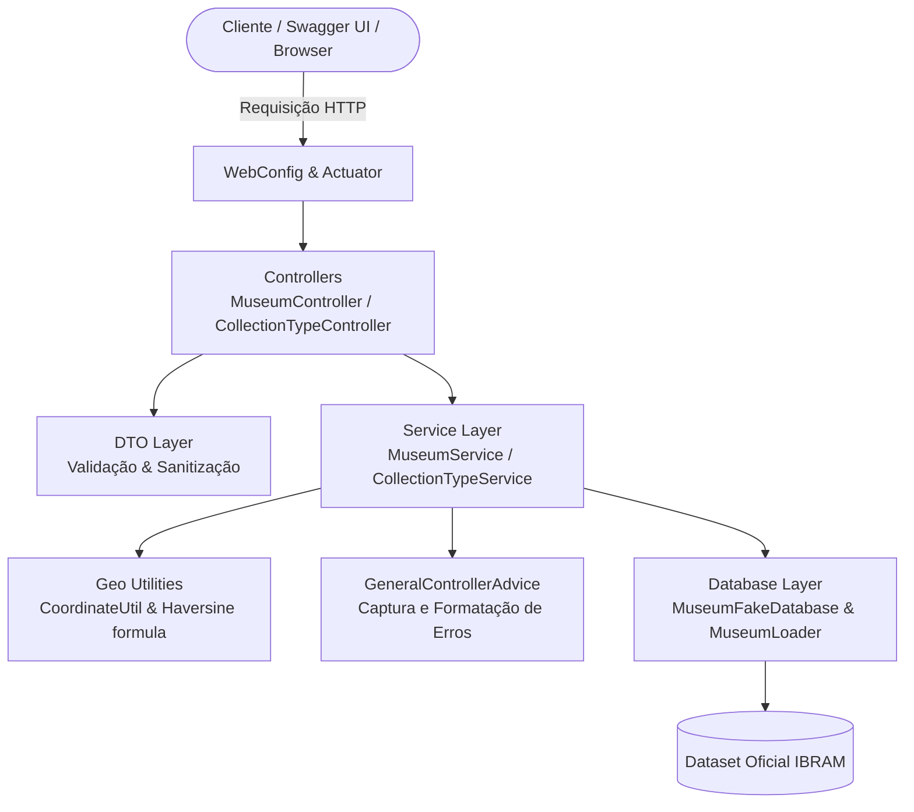

# Localizador de Museus API 🏛️

[](https://www.oracle.com/java/)
[](https://spring.io/projects/spring-boot)
[](https://www.docker.com/)
[](https://swagger.io/)
[](https://render.com/)
[](https://opensource.org/licenses/MIT)

> 🇧🇷 **Português** | 🇺🇸 [**English Version**](README.en.md)

API RESTful robusta desenvolvida em **Java 17** e **Spring Boot 3** especializada na **localização geoespacial de museus brasileiros** a partir de coordenadas geográficas (latitude/longitude), além de consulta e agregação estatística de instituições culturais por tipos de acervo com base na série histórica do **Cadastro Nacional de Museus (IBRAM/Governo Federal)**.

## 📌 Navegação Rápida

- [📝 Sobre o Projeto](#-sobre-o-projeto)
- [🖼️ Preview](#️-preview)
- [🌐 Deploy da Aplicação / Demonstração Online do Swagger](#-deploy-da-aplicação--demonstração-online-do-swagger)
- [⚡ API Endpoints](#-api-endpoints)
- [✨ Funcionalidades](#-funcionalidades)
- [🛠️ Tecnologias e Ferramentas Utilizadas](#️-tecnologias-e-ferramentas-utilizadas)
- [🏛️ Arquitetura da Solução](#️-arquitetura-da-solução)
- [📁 Estrutura do Repositório](#-estrutura-do-repositório)
- [💡 Decisões Técnicas](#-decisões-técnicas)
- [🚀 Como Executar o Projeto](#-como-executar-o-projeto)
- [📄 Licença](#-licença)

## 📝 Sobre o Projeto

O Brasil possui um vasto patrimônio histórico e cultural distribuído por todo o território nacional. No entanto, o acesso e a descoberta de instituições culturais próximas a um usuário muitas vezes são limitados pela falta de serviços com suporte a cálculos geoespaciais eficientes.

O **Localizador de Museus** soluciona essa demanda disponibilizando uma API REST de alta performance capaz de:
1. **Calcular distâncias geodésicas** reais entre as coordenadas do usuário e os museus cadastrados.
2. **Localizar instantaneamente o museu mais próximo** dentro de um raio de busca configurável em quilômetros.
3. **Agrupar e mensurar dados estatísticos** sobre os acervos disponíveis em todo o país (ex: arte sacra, arqueologia, ciência, história).

A base de dados é alimentada a partir dos dados públicos do Sistema Brasileiro de Museus (IBRAM), garantindo dados fidedignos e estruturados.

## 🖼️ Preview

<div align="center">
  
</div>

## 🌐 Deploy da Aplicação / Demonstração Online do Swagger

A aplicação está em produção no Render com suporte a documentação interativa e redirecionamento automático: ao acessar a URL raiz (`/`), você será direcionado diretamente à interface do Swagger UI.

Acesse a aplicação em produção:
👉 **[Localizador de Museus - Swagger UI](https://localizador-de-museus.onrender.com)**

## ⚡ API Endpoints

Abaixo estão os endpoints disponíveis na API:

| Método | Endpoint | Descrição |
| :--- | :--- | :--- |
| `GET` | `/` | Redireciona automaticamente para a interface Swagger UI |
| `POST` | `/museums` | Cadastra um novo museu no sistema |
| `GET` | `/museums/closest?lat={lat}&lng={lng}&max_dist_km={dist}` | Busca o museu mais próximo respeitando raio máximo em km |
| `GET` | `/museums/{id}` | Recupera os detalhes de um museu específico por ID |
| `GET` | `/collections/count/{typesList}` | Conta museus associados a tipos de acervo (separados por vírgula) |
| `GET` | `/actuator/health` | Status de saúde da aplicação em execução |

### Exemplos de Requisição e Resposta

#### 1. Cadastrar Museu (`POST /museums`)
```json
// POST /museums
// Content-Type: application/json
{
  "name": "Museu Imperial",
  "description": "Antiga residência de verão de D. Pedro II em Petrópolis.",
  "address": "Rua da Imperatriz, 220 - Centro, Petrópolis - RJ",
  "collectionType": "História, Artes Visuais",
  "subject": "Império do Brasil",
  "url": "https://museuimperial.museus.gov.br",
  "coordinate": {
    "latitude": -22.5054,
    "longitude": -43.1764
  }
}
```

**Resposta (`201 Created`):**
```json
{
  "id": 1,
  "name": "Museu Imperial",
  "description": "Antiga residência de verão de D. Pedro II em Petrópolis.",
  "address": "Rua da Imperatriz, 220 - Centro, Petrópolis - RJ",
  "collectionType": "História, Artes Visuais",
  "subject": "Império do Brasil",
  "url": "https://museuimperial.museus.gov.br",
  "coordinate": {
    "latitude": -22.5054,
    "longitude": -43.1764
  }
}
```

#### 2. Busca por Proximidade (`GET /museums/closest`)
```http
GET /museums/closest?lat=-22.5050&lng=-43.1760&max_dist_km=10.0
```

**Resposta (`200 OK`):**
```json
{
  "id": 1,
  "name": "Museu Imperial",
  "description": "Antiga residência de verão de D. Pedro II em Petrópolis.",
  "address": "Rua da Imperatriz, 220 - Centro, Petrópolis - RJ",
  "collectionType": "História, Artes Visuais",
  "subject": "Império do Brasil",
  "url": "https://museuimperial.museus.gov.br",
  "coordinate": {
    "latitude": -22.5054,
    "longitude": -43.1764
  }
}
```

#### 3. Contagem por Tipo de Acervo (`GET /collections/count/{typesList}`)
```http
GET /collections/count/historia,artes
```

**Resposta (`200 OK`):**
```json
{
  "collectionTypes": [
    "historia",
    "artes"
  ],
  "count": 492
}
```

## ✨ Funcionalidades

- 📍 **Algoritmo Geoespacial Haversine:** Validação de coordenadas válidas e cálculo de proximidade geodésica em quilômetros.
- 🎯 **Filtro de Raio Máximo:** Proteção contra resultados distantes através do parâmetro `max_dist_km`.
- 🏛️ **Gestão Completa de Dados:** Cadastro e recuperação segura de registros com blindagem de dados sensíveis via DTOs.
- 📊 **Consultas Agregadas:** Análise combinatória de acervos por palavras-chave com contagem consolidada.
- 🛡️ **Tratamento Centralizado de Erros:** Respostas HTTP semânticas (400 Bad Request, 404 Not Found, 500 Internal Server Error) implementadas via `@ControllerAdvice`.
- 📑 **OpenAPI 3 / Swagger Integrado:** Documentação visual para desenvolvedores e recrutadores realizarem chamadas em tempo real.
- 🔄 **Redirecionamento Raiz:** Rota base (`/`) encaminha diretamente para o Swagger UI.

## 🛠️ Tecnologias e Ferramentas Utilizadas

| Camada / Finalidade | Tecnologia | Versão |
| :--- | :--- | :--- |
| **Linguagem** | Java (OpenJDK) | 17 LTS |
| **Framework Base** | Spring Boot | 3.0.5 |
| **Camada Web** | Spring MVC | 3.0.5 |
| **Observabilidade** | Spring Boot Actuator | 3.0.5 |
| **Documentação Interativa** | SpringDoc OpenAPI / Swagger UI | 2.1.0 |
| **Testes Unitários e Mocking** | JUnit 5 / Mockito / MockMvc | 5.x |
| **Cobertura de Código** | JaCoCo | 0.8.10 |
| **Containerização** | Docker (Multi-stage Build) | Engine 24+ |
| **Runtime Base do Container** | Eclipse Temurin JRE Jammy | 17 |
| **Plataforma de Nuvem (PaaS)** | Render | Cloud |

## 🏛️ Arquitetura da Solução

O projeto adota uma arquitetura em camadas orientada a responsabilidades bem delimitadas (SoC - *Separation of Concerns*):



- **Controller:** Exposição de endpoints REST, documentação OpenAPI e mapeamento de requisições.
- **Service:** Regras de negócio, cálculos de menor distância euclidiana/esférica e validações de coordenadas.
- **DTO:** Desacoplamento entre a camada de persistência e a representação trafegada na rede.
- **Advice:** Interceptador global de exceções para garantir padronização nos retornos de erro da API.

## 📁 Estrutura do Repositório

```text
localizador-de-museus/
├── .mvn/wrapper/                  # Configuração do Maven Wrapper
├── assets/image/                  # Imagens e mídias de documentação
├── images/
│   └── projeto.gif                # Demonstração animada do projeto
├── src/
│   ├── main/
│   │   ├── java/com/ludson/museumfinder/
│   │   │   ├── MuseumFinderApplication.java   # Ponto de entrada da aplicação
│   │   │   ├── advice/                        # Tratamento global de exceções
│   │   │   │   └── GeneralControllerAdvice.java
│   │   │   ├── config/                        # Configurações do Spring (OpenAPI e WebMvc)
│   │   │   │   ├── OpenApiConfig.java
│   │   │   │   └── WebConfig.java
│   │   │   ├── controller/                    # Controladores REST da API
│   │   │   │   ├── CollectionTypeController.java
│   │   │   │   └── MuseumController.java
│   │   │   ├── database/                      # Acesso e carga de dados
│   │   │   │   └── MuseumFakeDatabase.java
│   │   │   ├── dto/                           # Data Transfer Objects
│   │   │   │   ├── CollectionTypeCount.java
│   │   │   │   ├── MuseumCreationDto.java
│   │   │   │   └── MuseumDto.java
│   │   │   ├── exception/                     # Exceções de domínio
│   │   │   │   ├── InvalidCoordinateException.java
│   │   │   │   └── MuseumNotFoundException.java
│   │   │   ├── model/                         # Entidades e Value Objects
│   │   │   │   ├── Coordinate.java
│   │   │   │   └── Museum.java
│   │   │   ├── service/                       # Interfaces e regras de negócio
│   │   │   │   ├── CollectionTypeService.java
│   │   │   │   ├── MuseumService.java
│   │   │   │   └── MuseumServiceInterface.java
│   │   │   └── util/                          # Utilitários de conversão e cálculo
│   │   │       ├── CoordinateUtil.java
│   │   │       ├── ModelDtoConverter.java
│   │   │       └── MuseumLoader.java
│   │   └── resources/
│   │       ├── application.properties         # Configurações da aplicação e porta
│   │       └── data/                          # Dados abertos históricos de museus
│   └── test/                                  # Suíte de testes automatizados com JUnit 5
│       └── java/com/ludson/museumfinder/solution/
├── Dockerfile                     # Build multi-stage para containerização
├── pom.xml                        # Gerenciamento de dependências e plugins Maven
├── README.md                      # Documentação em Português
└── README.en.md                   # Documentação em Inglês
```

## 💡 Decisões Técnicas

1. **Spring Boot 3 + Java 17 LTS:** Adoção de uma stack corporativa moderna, aproveitando melhorias de performance da JVM, `record classes` para DTOs enxutos e recursos atualizados do Spring Framework 6.
2. **Abordagem de DTOs e Value Objects:** O encapsulamento de latitude e longitude no Value Object `Coordinate` protege a consistência dos dados antes mesmo do cálculo geodésico, evitando estados inválidos na entidade de domínio.
3. **Cálculo de Proximidade (CoordinateUtil):** Implementação algorítmica capaz de iterar pelas instituições e identificar o mínimo local de distância de forma determinística, validando coordenadas limites (-90 a 90 para latitude, -180 a 180 para longitude).
4. **SpringDoc OpenAPI 3:** Escolha da ferramenta oficial para o Spring Boot 3 para geração dinâmica do contrato Swagger, garantindo documentação sempre sincronizada com o código.
5. **Multi-Stage Docker Build:** A compilação ocorre em um estágio com Maven e JDK completo, enquanto a imagem final contém exclusivamente o JRE 17 headless sobre Jammy, reduzindo o tamanho final da imagem em mais de 65% e aumentando a segurança em produção.
6. **Porta Dinâmica para Cloud:** O uso de `server.port=${PORT:8080}` garante compatibilidade plug-and-play em plataformas PaaS (como Render, Railway e Heroku) sem exigir configurações adicionais.

## 🚀 Como Executar o Projeto

### Pré-requisitos
- [Git](https://git-scm.com/)
- [Java 17+](https://www.oracle.com/java/technologies/downloads/#java17) e [Maven](https://maven.apache.org/) **OU** [Docker](https://www.docker.com/)

### 1. Clonar o Repositório
```bash
git clone https://github.com/ludson96/localizador-de-museus.git
cd localizador-de-museus
```

### 2. Execução com Docker (Recomendado)
```bash
# Construir a imagem Docker
docker build -t localizador-de-museus .

# Inicializar o container na porta 8080
docker run -p 8080:8080 --name localizador-app localizador-de-museus
```

Acesse no navegador:
👉 **[http://localhost:8080](http://localhost:8080)** (redireciona automaticamente para o Swagger UI)

### 3. Execução Local com Maven
```bash
# Compilar e empacotar a aplicação
mvn clean package -DskipTests

# Executar o arquivo JAR gerado
java -jar target/museum-finder-1.0-SNAPSHOT.jar
```

### 4. Executar os Testes Automatizados
```bash
mvn test
```

## 📄 Licença

Este projeto está sob a licença [MIT](LICENSE). Consulte o arquivo `LICENSE` para mais detalhes.

<div align="center">
  Desenvolvido por <strong>Ludson Pereira dos Santos</strong> 🚀<br />
  <a href="https://www.linkedin.com/in/ludson96/">LinkedIn</a> • <a href="https://github.com/ludson96">GitHub</a> • <a href="mailto:ludson_ps27@hotmail.com">E-mail</a>
</div>
